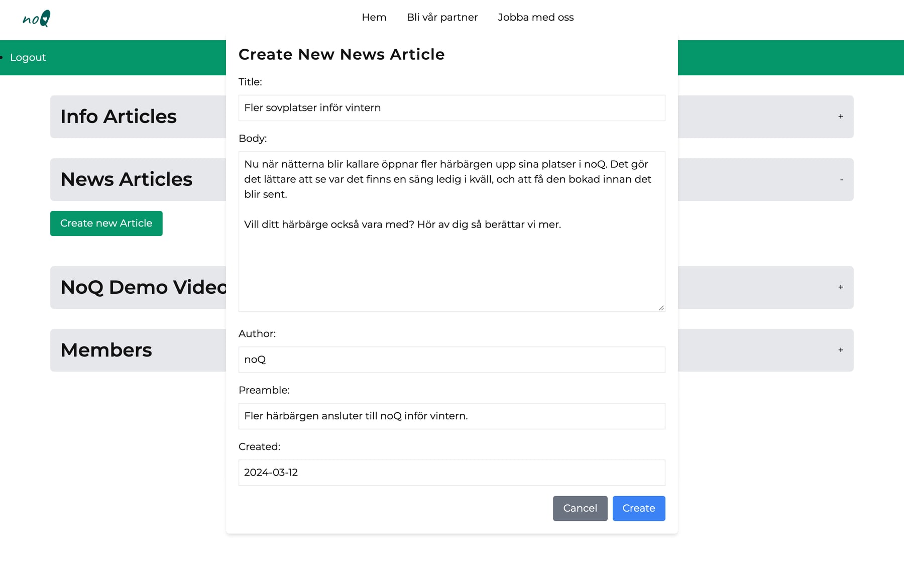
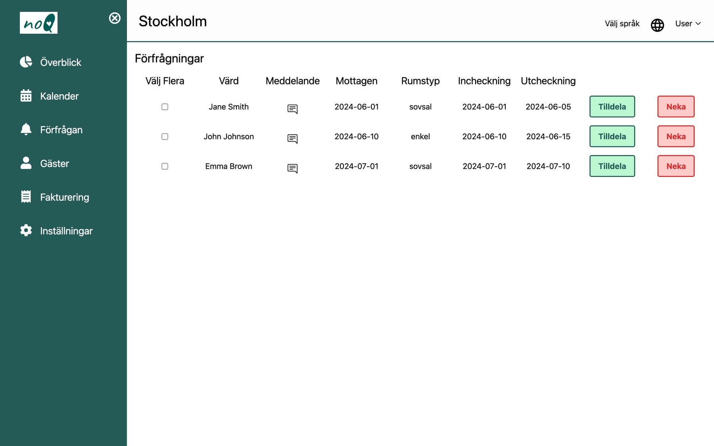

## Om noQ

noQ är en ideell tech-for-good-förening där alla jobbar ideellt. Målet är att göra det lättare för akut hemlösa i Stockholm att hitta en sovplats för natten, för härbärgen att administrera sina platser och för stadsdelarna att ha koll på läget. Under 2024 var jag en av volontärerna och jobbade med två delar.

## Hemsidan och dess CMS

Föreningen ville kunna berätta om sitt arbete själva, utan att en utvecklare behövde lägga in varje text. Vi var fyra utvecklare som byggde en ny hemsida med ett eget CMS, i React och Firebase.

- **Nyheter.** Jag byggde delen av CMS:et där man skapar, listar, redigerar och tar bort nyhetsartiklar.
- **Redigeraren.** Jag byggde textredigeraren som används i både nyheter och informationsartiklar, med rubriker, listor, fetstil och kursiv. Texten sparas strukturerat och visas som HTML på sidan, så den som skriver aldrig behöver röra kod.
- **Nattens temperatur.** Överst på hemsidan visas hur kallt det blir i Stockholm i natt, hämtat från ett öppet väder-API. Det är en enkel påminnelse om varför sovplatserna behövs.

Jag granskade och mergade också andras pull requests och uppdaterade sidorna när kraven ändrades.

## Appen för härbärgen

Efter hemsidan gick jag över till noQ:s huvudprodukt: webbappen där härbärgen tar emot och hanterar förfrågningar om sovplatser.

- **Satte upp frontend-projektet från grunden**, med Vite, React och Tailwind.
- **Byggde grundlayouten** med sidomeny och navigering, och de första datamodellerna för bokningar, härbärgen och lediga platser.
- **Byggde förfrågningssidan**, där härbärget ser inkomna förfrågningar och tilldelar dem en plats.

- **Skrev dokumentationen** för nya volontärer och granskade andras kod. I ett projekt där folk kommer och går hela tiden är det minst lika viktigt som själva koden.

Senare startade jag även appen för stadsdelarnas handläggare, med inloggning och grundlayout, och gjorde en mindre fix i Django-backenden.

Hemsidan och den här versionen av appen finns inte längre online. Skärmbilderna är tagna 2026, när jag körde koden från GitHub lokalt igen. Texten i formuläret och personerna i listan är exempel.

## Vad jag tar med mig

Att bygga i ett team av volontärer som kommer och går lär en att skriva kod som någon annan förstår i morgon, och att dokumentera det man gör. Och att även små saker, som en temperatur i ett sidhuvud, kan göra en sajt mer mänsklig.
