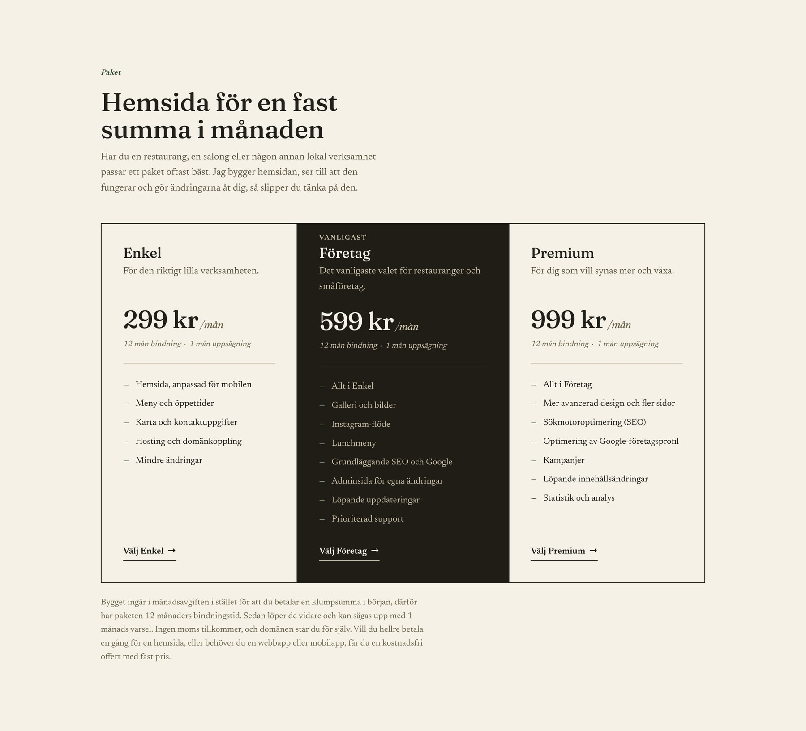
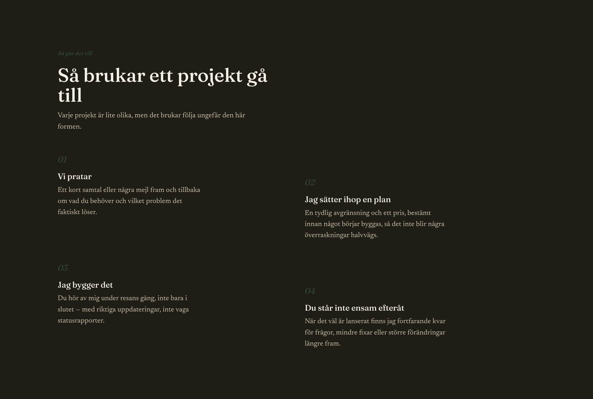
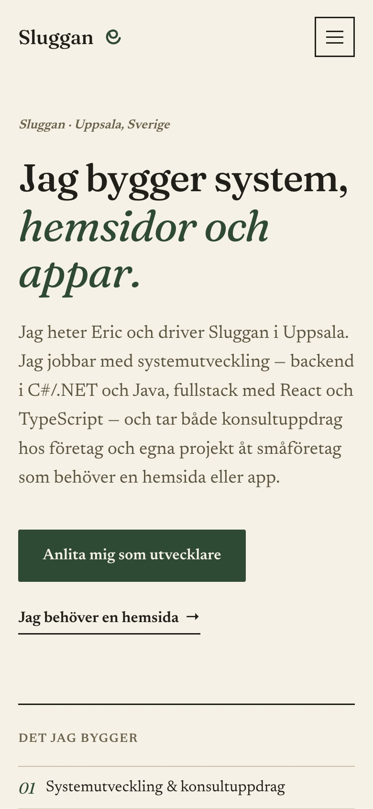
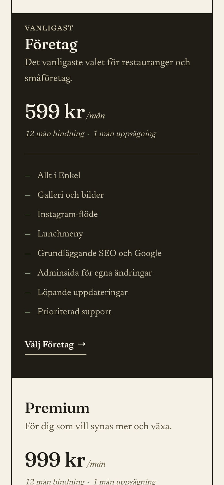

## Utgångsläget

Sajten var en personlig portfolio. När jag startade Sluggan behövde den bli något en kund faktiskt kan anlita: tydligt vad jag gör, vad det kostar och hur man hör av sig. Den skulle också visa hur jag själv jobbar, eftersom det är samma sak jag säljer.

## Vad jag gjorde

**En design som inte ser ut som alla andra.** Många sajter i dag liknar varandra, med blålila toningar, rundade kort och samma tre typsnitt. Jag valde en varm, papperslik bakgrund, skogsgrönt som enda accentfärg och typsnitten Fraunces och Newsreader. Layouten är medvetet ojämn: ett rutnät för tjänsterna, ett mörkt band för arbetsgången och priserna i tre kolumner.

**Texter som låter som en människa.** Inga modeord. Jag skriver i jag-form, eftersom det är jag kunden pratar med, och priserna står öppet i stället för "kontakta oss för pris".

**Snabb och lätt att hitta.** Sidorna förrenderas när sajten byggs, så både besökare och Google får färdig HTML direkt i stället för en tom sida som fylls i av JavaScript. Typsnitten ligger på samma server och laddas i förväg, så ingenting hoppar runt medan sidan laddar. Strukturerad data berättar för Google vad Sluggan är, var den finns och vad paketen kostar.

**Kontakt utan egen server.** Kontaktformuläret skickar via Web3Forms direkt till min mejl, med skydd mot spam. Väljer man ett paket fylls formuläret i automatiskt. En integritetspolicy beskriver vart uppgifterna tar vägen.

## Resultatet

En sajt som går att visa för kunder, fungerar lika bra i mobilen och kostar nästan ingenting i drift: GitHub Pages och Cloudflare är gratis, och domänerna kostar runt 300 kronor om året. Mätt med Google Lighthouse fick mobilversionen 99 i prestanda och 100 i tillgänglighet, bästa praxis och SEO.

Den här sidan är förresten byggd på samma sätt som alla projektsidor: en textfil och några bilder i en mapp, som blir en färdig sida när sajten byggs.
